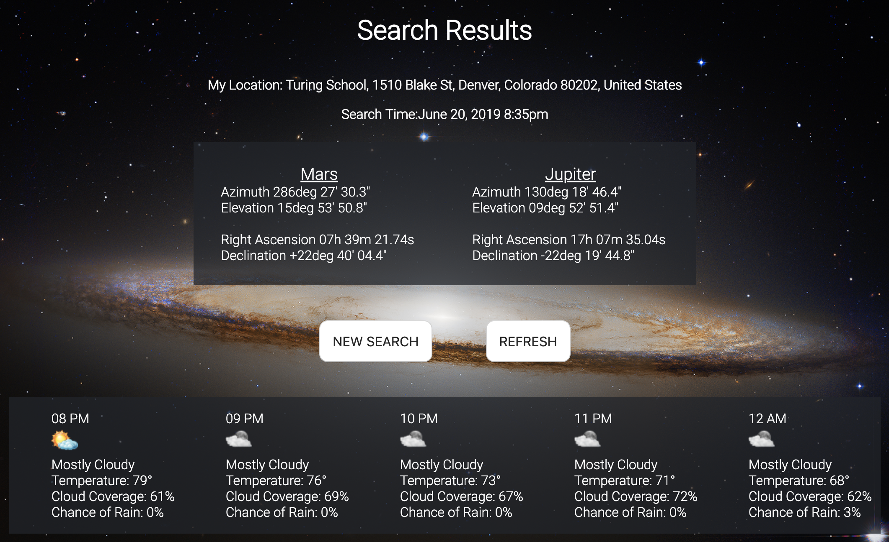

# Space In Your Face

## About

The goal of Space In Your Face (SIYF) is to bring telescope and naked eye astronomy to users of all ages and ability groups. Once registered with the site, users can select from a list of celestial bodies that they would like to observe, use the browser's geolocation or enter their desired location, and receive a 'look here in the sky' list of where to find their selections. Clicking through to any individual celestial body page allows the user to enter a web address to a hardware-enabled telescope and automatically point their telescope to that celestial body and track it for an hour. Additionally, users can search for the next pass time of the International Space Station and schedule a text alert for 15 minutes prior to the next pass to remind them to get outside and look up!

SIYF is a group effort originating during Module 3 at Turing School of Software & Design. This group project is the first at Turing to feature original student app ideas. This team included [Jeremy Bennett](https://github.com/JaxJafinPapau), [Deonte Cooper](https://github.com/djc00p), [Matt Levy](https://github.com/milevy1), [Corey Sheesley](https://github.com/CSheesley?tab=repositories), and [Matt Weiss](https://github.com/Matt-Weiss).


#### Celestial Body Search:



#### International Space Station Search:


## Future Iterations
Currently in development: are a calendar mailer that will send an email with upcoming viewing times for celestial bodies, weather forecasts to improve the chances of users spotting their favorite planet, and additions of near Earth objects and other trackable telescope-viewable celestial bodies to our database.

## Skyfield JSON
What do you do when the API that you planned your entire project around is no longer in service? You build your own open source Microservice to provide the API endpoints that you need. Using an impressive dataset provided by **Jet Propulsion Laboratory**, combined with a **Skyfield - Python** package that performs the orbital mechanic calculations required to find the apparent locations of celestial bodies  - we were able to build out a stand alone Python application which delivers the information that we consume by our **Space In Your Face** Rails application.

#### How To Use:


Endpoint for Celestial Bodies:\
`https://skyfield-json.herokuapp.com/ephemerides?`

Params:\
`longitude` - string with underscore and direction - Ex: `41_W`\
`latitude` - string with underscore and direction - Ex: `41_N`\
`bodies` - comma seperated string of celestial bodies - Ex: `mercury,venus,mars,jupiter`\
*at this time no key is needed for this request*

A successful request will have a URL which looks like this: \
`https://skyfield-json.herokuapp.com/ephemerides?longitude=41_W&latitude=41_N&bodies=mercury,venus,mars,jupiter`

#### Example JSON Output:
```
data: {
latitude: "41.345 N",
longitude: "41.112 W",
time: "2019-05-27 15:52:18",
celestial_bodies: [
{
name: "mercury",
decimal_attributes: {
ra: "4.778648664415373",
dec: "23.67915462647844",
az: "208.18889336319882",
el: "70.52100842964909"
},
strf_attributes: {
ra: "04h 46m 43.14s",
dec: "+23deg 40' 45.0"",
az: "208deg 11' 20.0"",
el: "70deg 31' 15.6""
}
},
{
name: "venus",
decimal_attributes: {
ra: "2.8393006859993086",
dec: "14.896838769797116",
az: "243.60921355444862",
el: "47.23444778722323"
},
strf_attributes: {
ra: "02h 50m 21.48s",
dec: "+14deg 53' 48.6"",
az: "243deg 36' 33.2"",
el: "47deg 14' 04.0""
}
}
```

## Connecting Telescope to **Space In Your Face** App

For our successful demonstration and proof of concept, we built a Flask app on a RaspberryPi 3 and exposed that application through an Ngrok tunneling service so that our deployed application could be reused with any similiar setup. Our telescope adjustments were made by stepper motors and custom 3D printed parts. Special thanks go to [Ian Douglas](https://github.com/iandouglas) for 3D printing and hardware integration support.

## Getting Set up

You will need to have Ruby 2.4.1 and Rails 5.2 installed to your ruby environment.

```
$ git clone git@github.com:Matt-Weiss/spaceinyourface.git
$ bundle update
$ bundle install
$ rake db:{create,migrate,seed}
$ rails s
```


## Key Learnings
- API Creation & Consumption
- Hardware Implementation
- Microservices
- Continuous Integration
- Caching
- Background Services
- OAuth

## Tech Stack Used
- Ruby 2.4.1
- Rails 5.2
- Python
- Flask
- RaspberryPi
- Ngrok
- Travis CI
- PostgreSQL
- Redis
- Sidekiq
- Heroku
- Twilio
